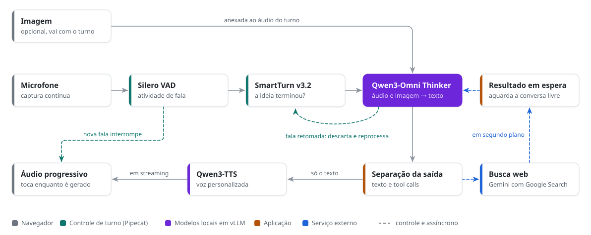

# Assistente multimodal por voz

Este projeto apresenta a implementação experimental de um sistema multimodal de conversação por voz em português. Construído pela adaptação dos pipelines de modelos públicos existentes e pela integração de seus componentes, o sistema reúne compreensão nativa de áudio e imagens, síntese com voz personalizada, controle automático dos turnos e busca web em um único pipeline de conversação.

O sistema foi projetado para oferecer baixa latência e uma troca natural de turnos. A demonstração mostra que é possível melhorar substancialmente a experiência em português combinando modelos especializados sem treinamento adicional.

## Demonstração

Vídeos de demonstração com o modelo rodando localmente em uma estação de trabalho.

https://github.com/user-attachments/assets/757f5c55-96f7-43e3-9fab-cefecfcfcd4a

**Converse sobre uma imagem:**

https://github.com/user-attachments/assets/e14bb457-8a15-4d58-8f23-1d562fb8f68d

## Principais capacidades

- **Execução local:** os modelos responsáveis pela compreensão e pela voz executam na infraestrutura local.
- **Conversa por voz em tempo real:** o sistema acompanha a fala, identifica pausas e decide quando responder.
- **Voz personalizada em português:** as respostas são sintetizadas pelo Qwen3-TTS com um áudio de referência em português. Nos testes qualitativos, essa combinação melhorou substancialmente a qualidade percebida da fala em relação à saída de voz original do Qwen3-Omni.
- **Troca de turnos natural e com baixa latência:** o sistema continua ouvindo enquanto prepara a resposta e reconsidera o turno quando o usuário retoma a fala.
- **Interrupção da resposta:** uma nova fala pode interromper o áudio do assistente.
- **Conversa sobre imagens:** o usuário pode mostrar uma imagem e fazer perguntas sobre ela por voz.
- **Busca web:** o assistente pode consultar informações atuais e fatos específicos durante a conversa.

## Por que essa abordagem?

As alternativas abertas disponíveis não reuniam conversação por voz em tempo real, compreensão multimodal e uma saída de voz adequada ao português em uma mesma solução. Este projeto partiu dessa lacuna para construir um sistema próprio a partir de componentes especializados.

O Qwen3-Omni fornece a compreensão direta de áudio e imagens. Para integrá-lo ao restante do sistema, seu pipeline original de inferência foi reconfigurado para executar o Thinker como uma etapa independente. O Talker e o Code2Wav foram retirados do caminho de saída, que passou a utilizar o Qwen3-TTS com uma referência de voz em português.

Essa integração também incorpora controle automático dos turnos, interrupção, busca web e reprodução progressiva do áudio. Os componentes foram combinados sem fine-tuning ou treinamento adicional, preservando a possibilidade de avaliar e aprimorar cada parte separadamente.

## Comparação

A ausência de uma solução aberta que reunisse essas capacidades motivou a construção do pipeline. A tabela resume os principais modelos considerados e as limitações que procuramos superar.

| Modelo | Conversa por voz em tempo real | Português entrada | Português saída | Observação |
|---|:---:|:---:|:---:|---|
| **Nossa solução** | ✅ | ✅ | ✅ | Baseada em Qwen3-Omni + Qwen3-TTS |
| Qwen3-Omni-30B-A3B-Instruct | ❌¹ | ✅ | ⚠️² | Base multimodal do nosso pipeline |
| MiniCPM-o 4.5 | ✅ | ❌ | ❌ | Full-duplex em inglês e chinês |
| PersonaPlex 7B | ✅ | ❌ | ❌ | Full-duplex em inglês |
| Moshi | ✅ | ❌ | ❌ | Full-duplex em inglês |
| GLM-4-Voice | ❌ | ❌ | ❌ | Inglês e chinês |
| Step-Audio 2 mini | ❌ | ❌ | ❌ | Inglês e chinês |

¹ Embora a documentação do Qwen3-Omni anuncie conversação em tempo real, os pesos disponibilizados publicamente não oferecem essa funcionalidade. O modelo aberto exige o envio explícito de cada turno. A conversação em tempo real está disponível apenas na API privada do serviço.

² Embora indique suporte ao português, o modelo aberto não possui uma voz nativa específica para o idioma. Nos nossos testes, a saída falada apresenta um sotaque forte.

## Como funciona

<picture>
  <source media="(prefers-color-scheme: dark)" srcset="./arquitetura-dark.svg">
  
</picture>

O **Qwen3-Omni Thinker** recebe diretamente o áudio do turno e, quando disponível, a imagem e o histórico. Não existe uma etapa separada de transcrição antes do modelo. A resposta textual é processada e enviada ao **Qwen3-TTS**, que gera a voz usando áudio e transcrição de referência. Os dois modelos são servidos pelo **vLLM**.

A aplicação também separa chamadas de ferramenta do texto que será exibido e falado. Na demonstração atual, a camada de busca web utiliza Gemini com Google Search. Essa camada pode ser integrada a outras APIs de busca sem alterar os modelos de compreensão e voz.

### Resposta especulativa com retomada da fala

Pausas curtas na fala nem sempre representam o fim de um turno. Responder imediatamente pode interromper o usuário, enquanto esperar por mais silêncio aumenta a latência. Para equilibrar esses dois extremos, implementamos uma resposta especulativa com rollback de turno.

O sistema começa a preparar a resposta quando detecta um provável fim de fala. Se o usuário continuar, a geração provisória é descartada e o áudio completo é reprocessado como um único turno.

### Controle da conversa

O **Silero VAD**, integrado pelo Pipecat, identifica a atividade de fala. O **SmartTurn v3.2** estima se o turno do usuário está completo. A aplicação combina esses sinais com a geração, o histórico e a reprodução das respostas.

## Limitações atuais

Esta é uma implementação experimental em desenvolvimento. O funcionamento integrado ainda precisa de validação mais ampla e de melhorias de robustez antes de poder ser tratado como um sistema estável. Entre os pontos conhecidos está a compreensão de fala em português, principalmente para palavras, nomes próprios e termos específicos.
